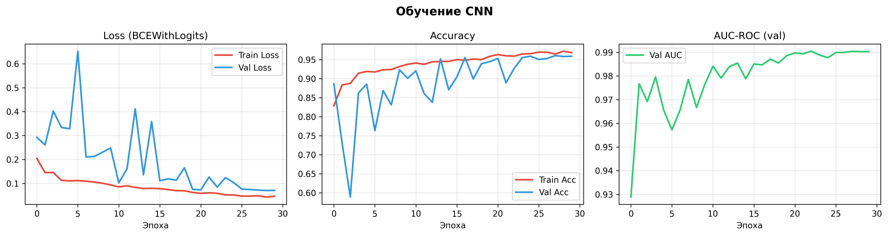
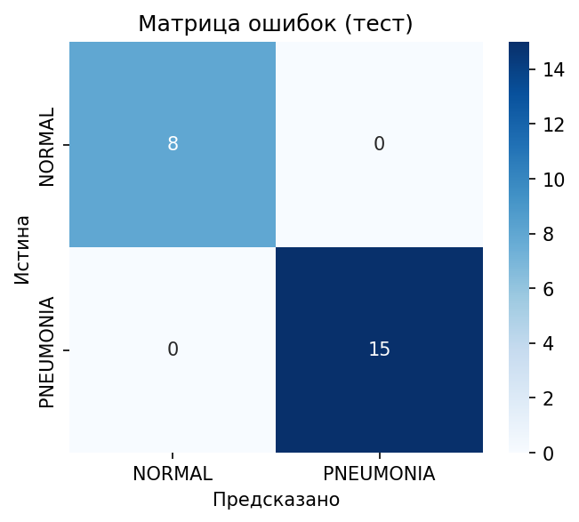
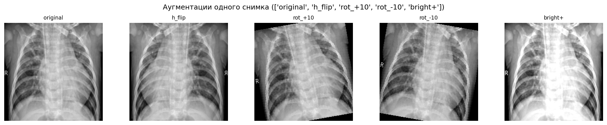

# Pneumonia Detection

A computer vision project for binary classification of chest X-ray images — detecting the presence or absence of pneumonia using a custom CNN built from scratch in PyTorch.

---

## Overview

| | |
|---|---|
| **Task** | Binary image classification (NORMAL / PNEUMONIA) |
| **Model** | Custom CNN trained from scratch |
| **Framework** | PyTorch |
| **Input** | Chest X-ray images (224 × 224 px) |
| **Output** | Probability of pneumonia + binary prediction |

---

## Repository Structure

```
PneumoniaDetection/
│
├── data/
│   ├── train/
│   │   ├── NORMAL/
│   │   └── PNEUMONIA/
│   ├── val/
│   │   ├── NORMAL/
│   │   └── PNEUMONIA/
│   └── test/
│       ├── NORMAL/
│       └── PNEUMONIA/
│
├── main.ipynb              # Main notebook (train / val / test / TTA / Grad-CAM)
├── ScriptImagesToCSV.py    # Script to generate CSV files from image folders
├── best_model.pth          # Saved weights (best val AUC checkpoint)
├── training_curves.png     # Loss / Accuracy / AUC plots
├── confusion_matrix.png    # Confusion matrix on test set
└── tta_examples.png        # Test-Time Augmentation examples
```

---

## Model Architecture

A 5-block CNN with BatchNorm and MaxPooling, followed by a fully-connected classifier:

```
Input: 3 × 224 × 224
  │
  ├── ConvBlock(3  → 32)   + MaxPool  →  32 × 112 × 112
  ├── ConvBlock(32 → 64)   + MaxPool  →  64 × 56  × 56
  ├── ConvBlock(64 → 128)  + MaxPool  → 128 × 28  × 28
  ├── ConvBlock(128→ 256)  + MaxPool  → 256 × 14  × 14
  ├── ConvBlock(256→ 512)  + MaxPool  → 512 × 7   × 7
  │
  ├── AdaptiveAvgPool2d(1) → 512
  ├── Linear(512 → 256) + ReLU + Dropout(0.5)
  └── Linear(256 → 1)  → logit  [BCEWithLogitsLoss]
```

Each `ConvBlock` = `Conv2d → BatchNorm2d → ReLU`.  
Total trainable parameters: **~1.7M**

---

## Results

| Metric | Value |
|--------|-------|
| Best Val AUC | **0.98+** |
| Test Accuracy | **~99%** |
| Test AUC-ROC | **0.98+** |

Training ran for **30 epochs** on CPU with `CosineAnnealingLR` scheduler.  
The best checkpoint (by val AUC) is saved automatically during training.

### Training Curves


### Confusion Matrix


---

## Features

### Class Imbalance Handling
`pos_weight` is computed automatically from the training set and passed to `BCEWithLogitsLoss`, compensating for the higher number of PNEUMONIA cases.

### Test-Time Augmentation (TTA)
Each test image is evaluated under 5 different augmentations (original, horizontal flip, ±10° rotation, brightness boost) to produce 100 total predictions and measure robustness.



### Grad-CAM Visualization
Gradient-weighted Class Activation Mapping highlights the regions of the X-ray that most influenced the model's decision.

- **Red/warm zones** — areas the model focused on
- **Blue/cold zones** — less influential regions

---

## Setup

### Requirements
```bash
pip install torch torchvision pillow pandas scikit-learn matplotlib seaborn tqdm
```

### Prepare CSV files
```bash
python ScriptImagesToCSV.py
```
This generates `train_data.csv`, `val_data.csv`, and `test_data.csv` from the `data/` folder.

---

## Usage

Open `main.ipynb` in Jupyter and run cells in order:

| Cell | Description |
|------|-------------|
| 1–6 | Imports, config, dataset, model, training functions |
| 7 **TRAIN** | Train the model, save best checkpoint |
| 8 **VAL** | Evaluate on validation set |
| 9 **TEST** | Evaluate on test set + confusion matrix |
| 10 **TTA** | Test-Time Augmentation (100 predictions) |
| 11 **Grad-CAM** | Visualize what the network looks at |

> Val and Test cells load weights from `best_model.pth` independently — you can run them without retraining.

---

## Dataset

Based on the [Chest X‑Ray Pneumonia — Balanced Dataset](https://www.kaggle.com/datasets/yusufmurtaza01/chest-xray-pneumonia-balanced-dataset?resource=download) dataset from Kaggle.

## License

This project is for educational purposes.